# 📦 empacotamento-api

Projeto desenvolvido com Java 17, Spring Boot 3.5.0 e Docker, simulando um sistema de empacotamento de produtos com diferentes dimensões em caixas de tamanho fixo. 
O objetivo principal é aplicar lógica de negócios para otimização de espaço e integração com ferramentas modernas de desenvolvimento.

## ✅ Funcionalidades

- Receber uma lista de produtos com dimensões variadas
- Calcular o volume de cada produto
- Empacotar produtos em caixas otimizando o uso de espaço
- Separar produtos que não cabem em nenhuma caixa disponível
- Permitir testes com produtos pequenos, médios, grandes e gigantes
- Documentação automática com Swagger
- Segurança via autenticação básica
- Deploy com Docker

## 🔁 Como Baixar o Repositório

1. Abra seu terminal (Git Bash ou Ubuntu/WSL)
2. Escolha a pasta onde deseja salvar o projeto
3. Execute o comando:

```bash
git clone https://github.com/wesleymrosa/empacotamento.git
cd empacotamento
```

## 🐳 Como Executar com Docker

### 1. Gerar o JAR

```bash
mvn clean install
```

### 2. Subir com Docker Compose

```bash
docker-compose up --build
```

### 3. Acessar a aplicação

- Swagger UI: [http://localhost:8080/swagger-ui.html](http://localhost:8080/swagger-ui.html)
- Usuário: `admin` | Senha: `admin`

## 📂 Estrutura do Projeto

```bash
src/
├── main/
│   ├── java/
│   │   └── br/wesley/empacotamentoapi/
│   │       ├── controller/
│   │       ├── dto/
│   │       ├── model/
│   │       ├── service/
│   │       ├── util/
│   │       └── EmpacotamentoApiApplication.java
│   └── resources/
│       └── application.properties
```

## 📥 JSONs de Teste

### ✅ Produtos Pequenos
```json
[
  { "nome": "Cabo USB", "comprimento": 10, "largura": 5, "altura": 3 },
  { "nome": "Caneta", "comprimento": 14, "largura": 2, "altura": 2 }
]
```

### 🟡 Produtos Médios
```json
[
  { "nome": "Notebook", "comprimento": 35, "largura": 25, "altura": 3 },
  { "nome": "Caixa de ferramentas", "comprimento": 40, "largura": 30, "altura": 20 }
]
```

### 🔵 Produtos Grandes
```json
[
  { "nome": "Micro-ondas", "comprimento": 55, "largura": 40, "altura": 35 },
  { "nome": "Impressora", "comprimento": 60, "largura": 45, "altura": 30 }
]
```

### 🔴 Produtos Gigantes
```json
[
  { "nome": "TV 50 Polegadas", "comprimento": 100, "largura": 20, "altura": 70 },
  { "nome": "Geladeira Duplex", "comprimento": 80, "largura": 60, "altura": 200 },
  { "nome": "Sofá 3 Lugares", "comprimento": 200, "largura": 90, "altura": 85 }
]
```

### ⚠️ Produto Muito Maior que a Caixa
```json
[
  { "nome": "Container de Transporte", "comprimento": 500, "largura": 200, "altura": 250 }
]
```

### 📭 Nenhum Produto
```json
[]
```

## 📸 Print da Execução via Docker no WSL2

📸 Prints da Aplicação

### ▶️ Execução da aplicação
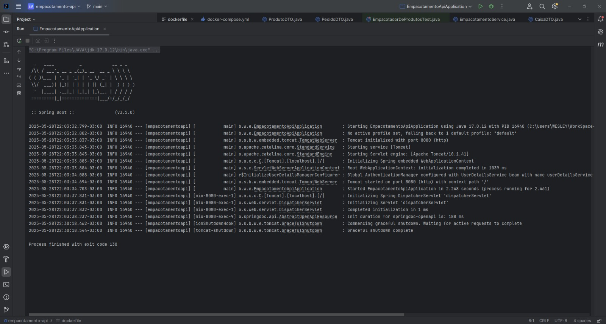

### ✅ Build do projeto
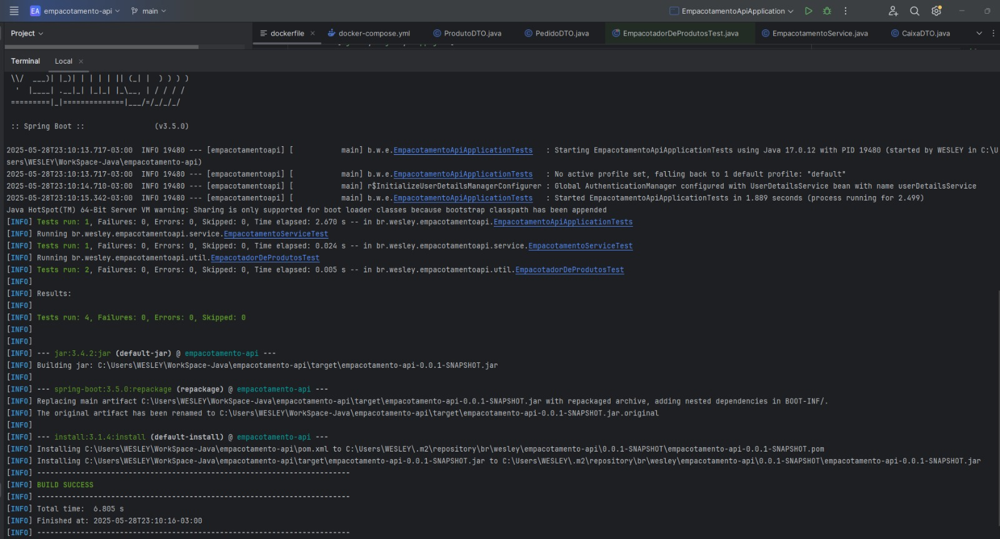

### 📘 Imagem Swagger 
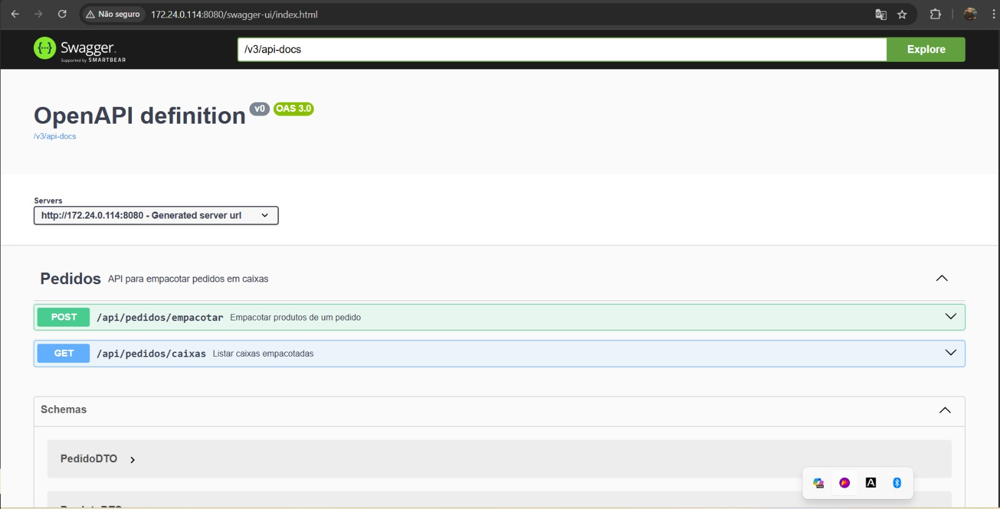

### Produtos pequenos
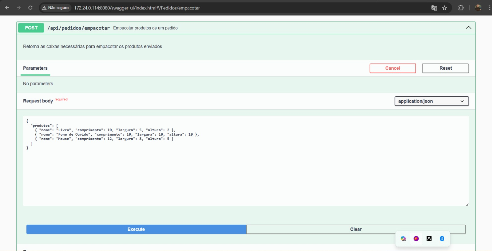

### Produtos pequenos
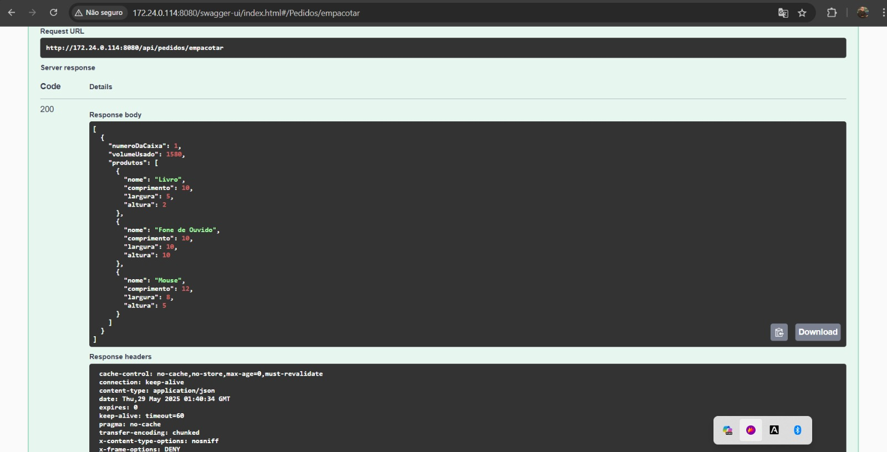

### Produtos médios
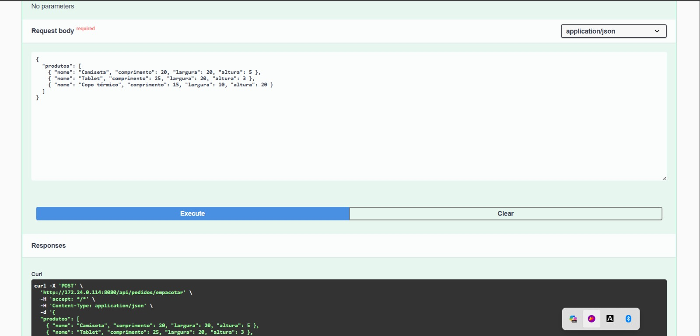

### Produtos médios
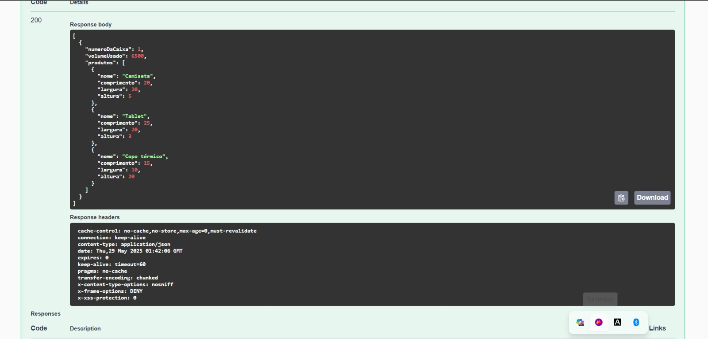

### Produtos grandes
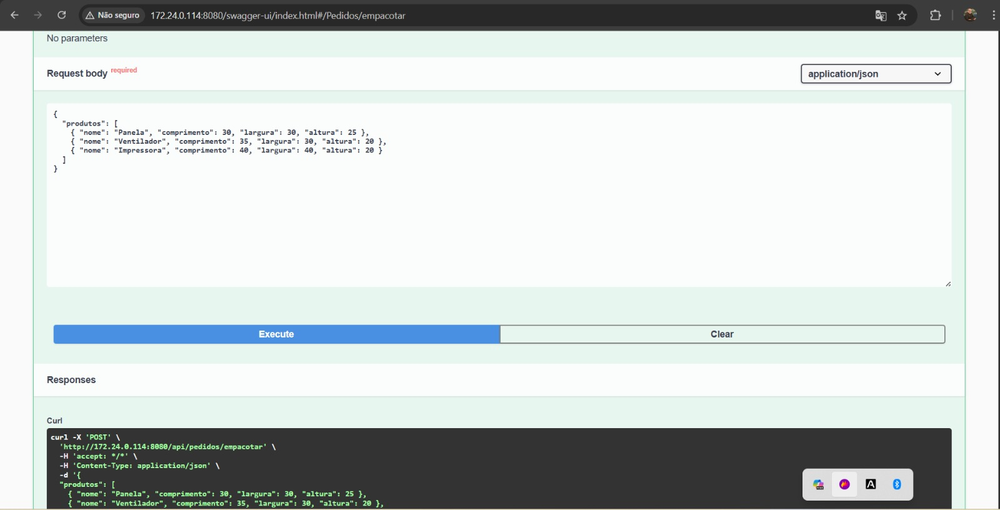

### Produtos grandes
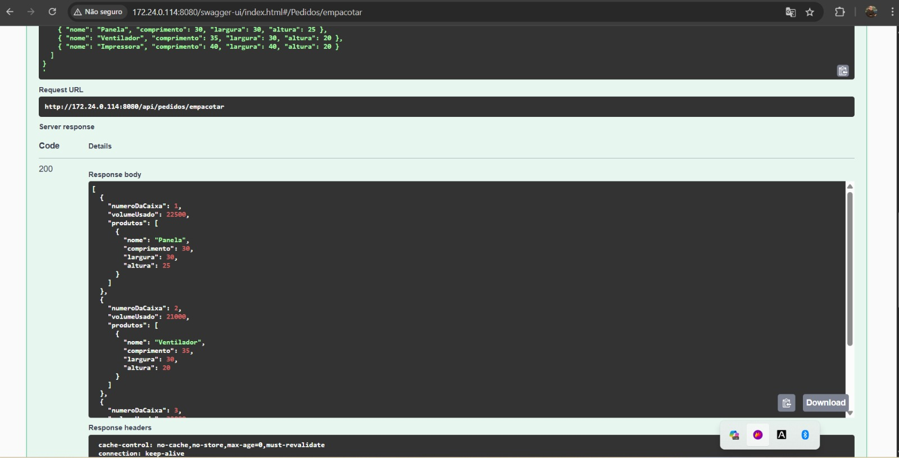

### Produtos gigantes
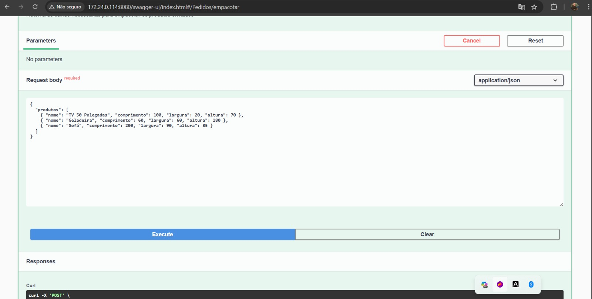

### Produtos gigantes
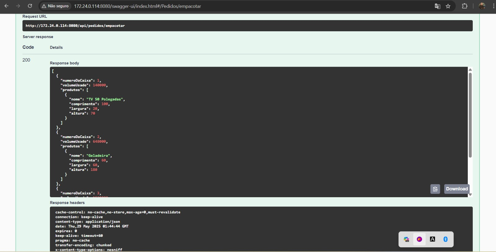

### Nenhum produto
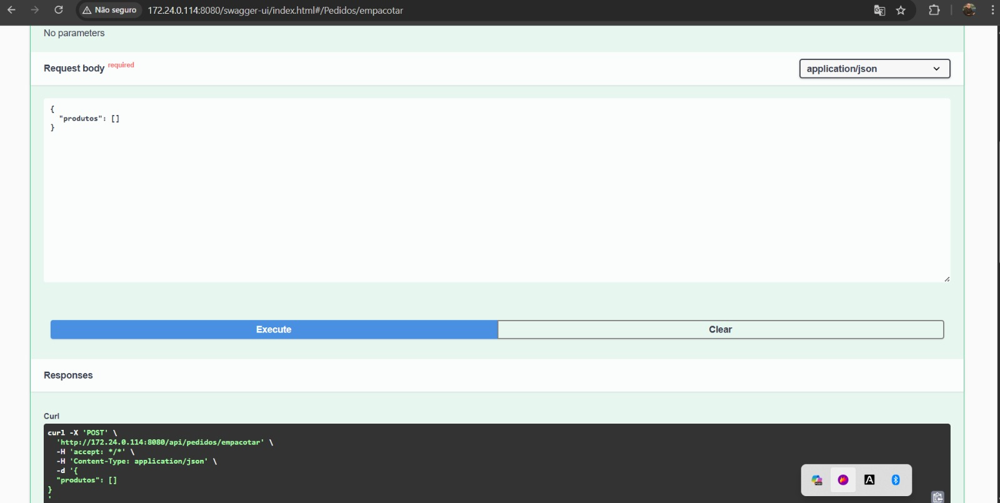

### Nenhum produto
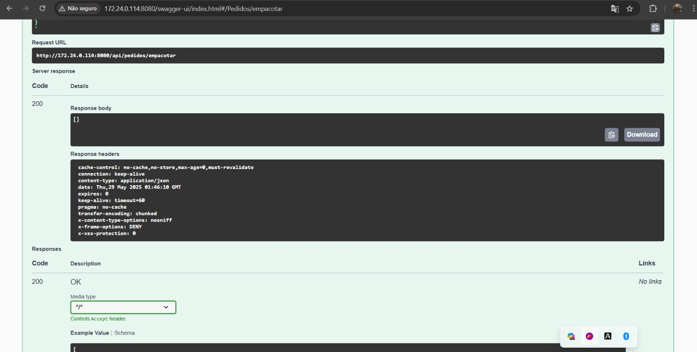

### Produto que não cabe
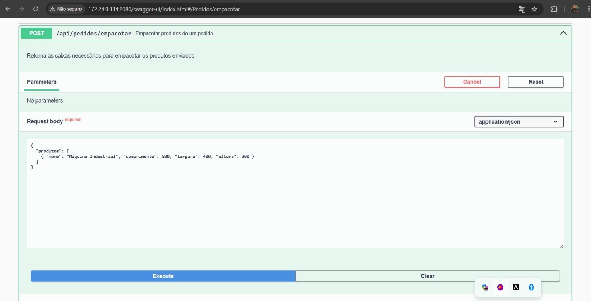

### Produto que não cabe
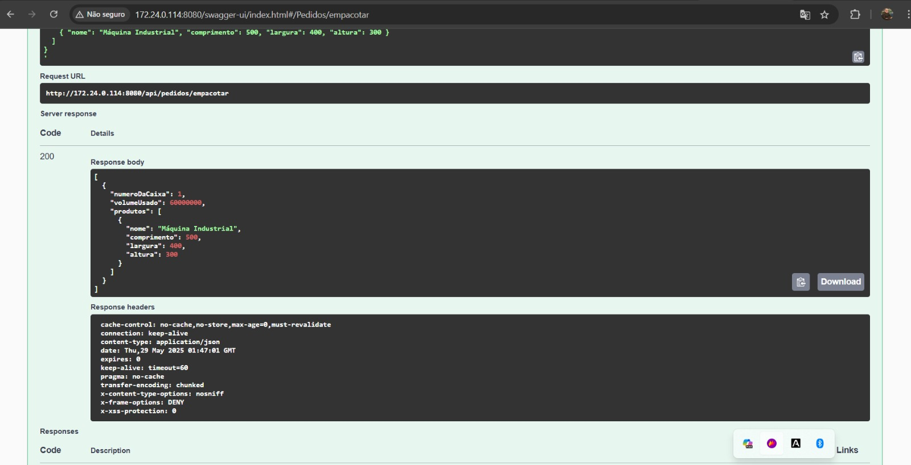


## 🧠 Conceitos Trabalhados

- Lógica de empacotamento baseada em volume
- Arquitetura em camadas com DTO, Service, Controller
- Boas práticas com Java e Spring Boot
- Segurança com autenticação básica
- Documentação com Swagger OpenAPI
- Build e deploy com Docker

## 👤 Autor

**Wesley Martins Rosa**  
📧 Email: wesleymrosa@gmail.com  
🐙 GitHub: [github.com/wesleymrosa](https://github.com/wesleymrosa)  
🔗 LinkedIn: [www.linkedin.com/in/wesleymrosa](https://linkedin.com/in/wesleymrosa)

## 📅 Licença

Sinta-se à vontade para estudar, adaptar e aprimorar.
